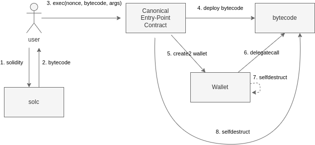

*These smart contracts were developed for our EthDenver '23 hackathon project W41337!*
# ECo Wallets
An **e**phemeral, **co**unterfactual wallet primitve for cool hacker devs with certain desirable properties:
- Smart: Runs arbitrary bytecode (only) when you interact with it.
- Convenient: Instantly execute code on-chain without a separate deployment step. 
- Non-polluting: Leaves no state or code behind after it executes.
- Stateless/Codeless: No code means no need to implement token receiver callbacks.
- Safer: No code hanging around to hack.

## Lifecycle

1. Write code.
2. Compile into runtime bytecode.
3. Submit bytecode to canonical entry point contract.
4. Entry point hot-patches and deploys the runtime bytecode.
5. Entry point deterministically deploys your smart wallet.
6. Smart wallet initcode delegatecalls into runtime bytecode.
7. Smart wallet initcode self-destructs.
8. Entry point triggers deployed runtime bytecode to also self-destruct.

### Deployments

| Network | Address  |
|---------|----------|
| Goerli  | [0x82b035B4405Dd60b449b054894004FeE80566655](https://goerli.etherscan.io/address/0x82b035B4405Dd60b449b054894004FeE80566655) |

#### Demo App
TBD